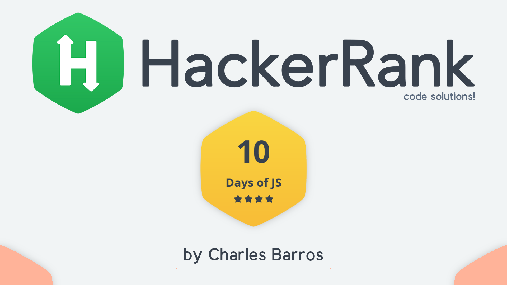
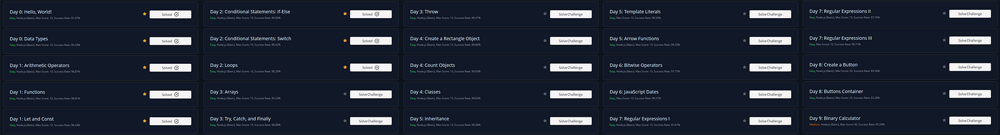

    

    

<h1 align='center'>10 Days of Javascript Challenge</h1>

    <h3>
      <a href='https://www.hackerrank.com/domains/tutorials/10-days-of-javascript' target="_blank"> HackerRank Platform</a>
    </h3>

## <strong>The Challenge</strong>
This is a series of 25 Javascript Coding Challenges, spread over 10 days exploring the main aspects of the Javaccript language such as variables, conditionals, objects, loops, functions, etc.

## <strong>Guide Execution for VSCode</strong>

    All challenges are designed to be written on the Hacker Rank platform itself, where they are executed, tested and fixed, however, to work locally, through VSCode, some adjustments are necessary. 
    To test locally, simply open the index.html file in your IDE and uncomment the line containing the <strong>script</strong> tag with the challenge you want to test. 
    To check the result, simply run the index.html file and check the output in the Browser Console tab.

## <strong>Solutions</strong>
- [Day 0: Hello, World!](https://www.hackerrank.com/challenges/js10-hello-world/problem?isFullScreen=true)
- [Day 0: Data Types](https://www.hackerrank.com/challenges/js10-data-types/problem?isFullScreen=true)
- [Day 1: Arithmetic Operators](https://www.hackerrank.com/challenges/js10-arithmetic-operators/problem?isFullScreen=true?isFullScreen=true)
- [Day 1: Functions](https://www.hackerrank.com/challenges/js10-function/problem?isFullScreen=true)
- [Day 1: Let and Const](https://www.hackerrank.com/challenges/js10-let-and-const/problem?isFullScreen=true)
- [Day 2: Conditional Statements: If-Else](https://www.hackerrank.com/challenges/js10-if-else/problem?isFullScreen=true)
- [Day 2: Conditional Statements: Switch](https://www.hackerrank.com/challenges/js10-switch/problem?isFullScreen=true)
- [Day 2: Loops](https://www.hackerrank.com/challenges/js10-loops/problem?isFullScreen=true)
- [Day 3: Arrays](https://www.hackerrank.com/challenges/js10-arrays/problem?isFullScreen=true)
- [Day 3: Try, Catch, and Finally](https://www.hackerrank.com/challenges/js10-try-catch-and-finally/problem?isFullScreen=true)
<!--
- [Day 3: Throw](#)
- [Day 4: Create a Rectangle Object](#)
- [Day 4: Count Objects](#)
- [Day 4: Classes](#)
- [Day 5: Inheritance](#)
- [Day 5: Template Literals](#)
- [Day 5: Arrow Functions](#)
- [Day 6: Bitwise Operators](#)
- [Day 6: JavaScript Dates](#)
- [Day 7: Regular Expressions I](#)
- [Day 7: Regular Expressions II](#)
- [Day 7: Regular Expressions III](#)
- [Day 8: Create a Button](#)
- [Day 8: Buttons Container](#)
- [Day 9: Binary Calculator](#) -->

- The rest of the challenges are still under development ... 

## <strong>Acknowledgments</strong>
I would like to thank the entire [HackerRank](https://www.hackerrank.com/) platform team for the excellent content made available.

